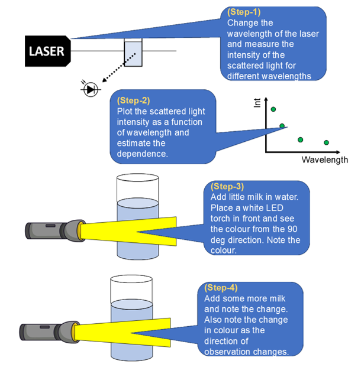
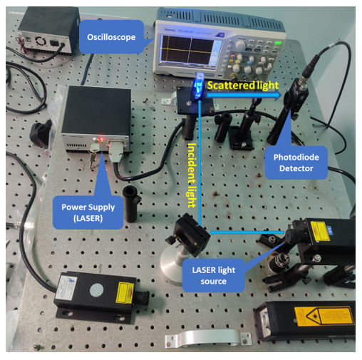
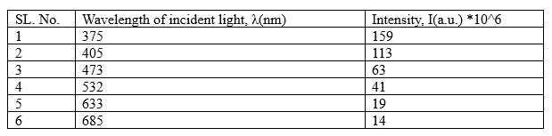
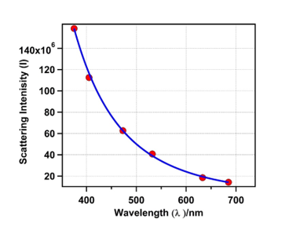

<b>Apparatus : </b> 
A.	Transparent glass container filled with milk-water mixture. 
B.	Flashlight 
C.	LASER light source of different wavelength 
D.	Cuvette 
E.	Photodiode detector 
F.	Oscilloscope  

<b>Procedure in laboratory (diagram) : </b> 

  

<b>Procedure in laboratory : </b> 
  

<b>Data and Analysis : </b> 
The scattering intensity for each different incident wavelength is measured which is given below in table. 

  

The scattering light intensity, I, is plotted against λ (wavelength of incident light) which is shown in the figure below. This plot fits very well with the equation, I=c*(1/λ)4, where ‘c’ is the fitting constant.

  

<b>Analysis : </b> 
1. Determine the dependence of incident light wavelength on scattering light intensity.  
2. Check if it follows (1/λ)4 dependency.
