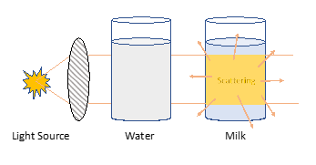
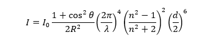

The colour of the sky changes during sunrise and sunset time from the daytime because of the different extend of scattering of the sunlight by the particles present in the atmosphere. The sunlight has to cross the atmosphere before it reaches our eyes. If we think that the atmosphere acts like a coating covering of the Earth, sunlight at noon passes through the thinnest part of the coating as the sun is just above us i.e. closest to the Earth. So in this case the scattering is less as there is least number of particles in the path. During sunrise and sunset, light has to take a sideways path to the same point, through a lot more "coating", which means there are a lot more particles that can scatter light more. While multiple types of scattering occur in the Earth's atmosphere, Rayleigh scattering is primarily responsible for this. 

In this experiment a transparent container is filled partially with water. Now if we turn on the flashlight and hold it flat against the side of the container, we won't be able to see the beam of the flashlight. This is much like how sunlight travels through space. Now we add some small amount of milk and stir the mixture. Now, if we shine the flashlight again from the previous position, we can see the beam of light in the water. If we now examine the container from all sides, the flashlight beam looks slightly blue from the side of the container, while the end of the flashlight appears slightly yellow. If we add more milk into the water, the beam appears even bluer from the side of the container, while the path of the beam farthest from the container changes from yellow to orange. The beam also spread out as it crosses the container. The blue end is like the sky at noon on a clear day. The orange end is like the sky near sunrise or sunset. 

 
<b>Figure 1.</b> Illustration of scattering through the milk/water solution  

Light travels in a straight line until it encounters particles where it gets deflected or scattered. In pure air or water, you can't see a beam of light and it travels along a straight path. When there are particles in the air or water, light is scattered by the edges of the particles. Milk is a colloid that contains tiny particles of fat and protein. When mixed with water, the particles scatter light much as dust scatters light in the atmosphere. Light is scattered differently, depending on its colour or wavelength, as well as depends on the size of the particle. In visible region of the electromagnetic spectrum, violet-blue light is scattered the most, while the orange and red light is scattered the least. Looking at the daytime sky is like viewing a flashlight beam from the side where we see the scattered blue light. Looking at sunrise or sunset is just like looking the beam across the container where we see the light that isn't scattered, which is orange and red. As we increase the amount of milk, the number of colloidal particles in the water will be increased and the beam of the flashlight is more strongly scattered, and the blue and orange part will become more intense. 

When scattering from a particle of size d with light of wavelength λ, the Rayleigh scattering is found to be: 

 

Where R is the distance to the particle, n is the refractive index, and θ is the angle of scattering from the incident light.
